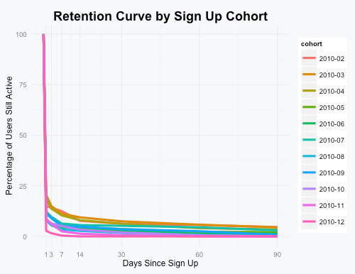
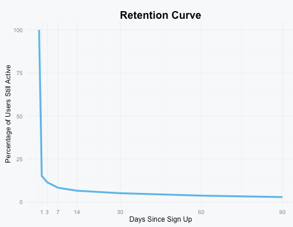

# Retentioneer

Retentioneer is an R script that enables you to analyze your app's retention rates broken down by signup cohort.

If you've never used R before, you'll need to [install R](https://cran.r-project.org/mirrors.html) and optionally download a tool like [RStudio](https://www.rstudio.com/products/rstudio/download/) to run this script. You'll also need to install the `ggplot2` package with `install.packages("ggplot2")` and use `setwd()` to change the working directory to match the location of this script.

## How it works

If you run a web or mobile app, you might be interested to know how long your users remain active. For example, did the users who signed up last January stick around longer than those who signed up this January? This script helps you figure it out.

In order for the script to work, all you need to do is to generate a CSV file containing a list of user ids and unix timestamps of when the users performed actions in your app.  Here's an example:

```
2,1270858427
2,1274045948
2,1274046075
3,1264910141
3,1264910158
3,1264910269
3,1264959922
4,1264959038
4,1286368585
```

The provided `data/test-data.csv` contains a test dataset that you can use to test the script.

...

## Testing the script

Within RStudio, simply load the script using `source("retentioneer.R")`.

If all went well, it will run the following code at the bottom of the file:

`AnalyzeRetention("data/test-data.csv", cohort.units = "months")`

... which will generate output the following retention table:

```
     cohort days.retained users.retained retention.rate
1   2010-02             0            481    100.0000000
2   2010-02             1             72     14.9688150
3   2010-02             5             65     13.5135135
4   2010-02            10             41      8.5239085
5   2010-02            20             34      7.0686071
6   2010-02            30             30      6.2370062
7   2010-02            40             29      6.0291060
...
```

... and generate the following chart:



If your data spans multiple years, you can specify `years` for the `cohort.units` argument:

`AnalyzeRetention("data/test-data.csv", cohort.units = "years")`

If you'd prefer to see the average retention rate across all of the cohorts, you can pass an `avg.only` argument set to `TRUE`.

`AnalyzeRetention("data/test-data.csv", avg.only = TRUE)`

```
   days.retained users.retained retention.rate
1              0           7424     100.000000
2              1           1126      15.167026
3              5            709       9.550108
4             10            529       7.125539
5             20            433       5.832435
6             30            381       5.132004
```



## Contact

If you have any suggestions, find a bug, or just want to say hey drop me a note at [@mhmazur](https://twitter.com/mhmazur) on Twitter or by email at matthew.h.mazur@gmail.com.

## License

MIT © [Matt Mazur](http://mattmazur.com)
